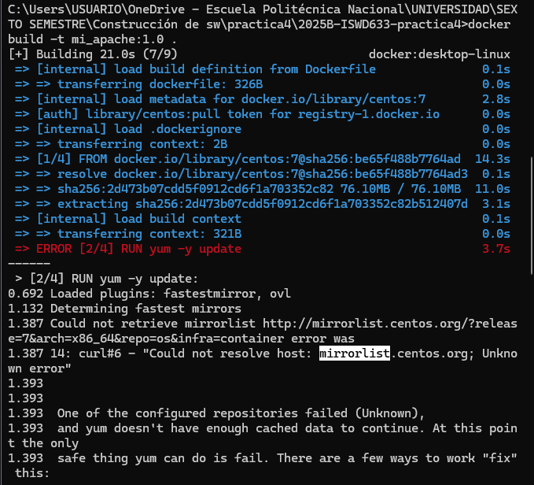
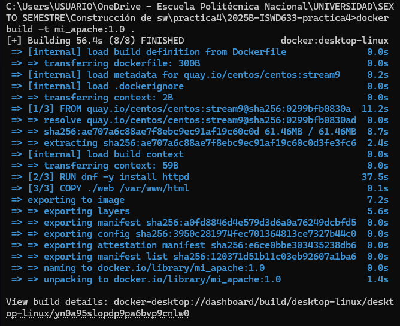
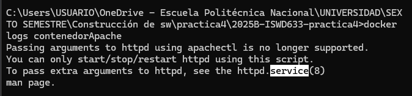

# COMPLETAR  
Comparando sus conocimientos antes de hacer la práctica con sus conocimientos después de hacer la tarea, explicar los principales aprendizajes logrados para beneficio de su formación profesional.  
Si solucionó un problema presentado al realizar la práctica también se debe documentar.


## ¿Por qué es importante limitar los recursos que ocupará un contenedor?
* Porque al delimitar los recursos se puede evitar una serie de problemas como degradación del rendimiento al ejecutar los contenedores.

## ¿Qué es memoria swap?
* Es un archivo que se almacena en el disco duro y se utiliza cuando la RAM física ya está llena. Cuando esto pasa, los archivos menos utilizados se envían a la memoria swap y se libera espacio en la RAM.
* Para especificar cuanto espacio tendrá la memoria swap es importante incluir --memory, caso contrario generará error.

### ¿Cómo calcular la memoria swap?
Memoria swap máxima = *memory-swap − memory

## Para revisar el nro. de núcleos e hilos
* Desde el adiministrador de tareas.
* Comando:
```
wmic cpu get NumberOfCores, NumberLogicalProcessors
```

## ¿Qué es Healthcheck?
* Es una configuración en donde se especifica un comando para determinar el estado en el que se encuentra el contenedor, si la salida es  0 significa que se encuentra en buen estado y si es diferente de 0, algo está mal.


## ERROR 1:
El problema se debió a que se estaba utilizando la imagen base CentOS 7 y esta versión ya no tiene repositorios activos, por lo que al ejecutar yum -y update no podía conectarse y fallaba la construcción de la imagen.

Posteriormente, se intentó usar CentOS Stream 8, pero también fallaba porque los repositorios de Stream 8 ya no funcionan correctamente.



### Solución:
Utilicé CentOS Stream 9 (quay.io/centos/centos:stream9), que tiene repositorios activos y confiables. Además, en Stream 9 se reemplaza yum por dnf, que es el administrador de paquetes moderno y soporta correctamente la instalación de Apache.

```
#FROM centos:7
#FROM centos:stream8
FROM quay.io/centos/centos:stream9
```



## ERROR 2:
Al intentar ejecutar  el contendor:
```
docker run -d --name contenedorApache -p 8080:80 mi_apache:1.1
```
El contenedor sale inmediatamente con el siguiente mensaje de error:


### Causa del error:
* Porque en CentOS Stream 9, el script apachectl ya no permite pasar argumentos como -D FOREGROUND.

### Solución:
Utilicé directamente el comando httpd con la opción --DFOREGROUND. Esto se cambió en el Dockerfile.
Después de corregir:
* Reconstruir la imagen.
* Ejecutar el contenedor.
* Verificar que esté corriendo.

## Políticas de reinicio en Docker

| Política        | Descripción |
|-----------------|-----------------|
| **no**          | Nunca se reinicia el contendor. |
| **always**      | Reinicia siempre el contenedor si se detiene. Y si se detiene manualmente, solo se reinicia al reiniciar Docker o manualmente. |
| **unless-stopped** | Similar a `always`, pero si se detiene manualmente, **no** se reinicia, incluso después de reiniciar Docker. |
| **on-failure**  | Solo se reinicia si el contenedor termina con un código de error distinto de 0. No se reinicia si se detiene manualmente. |
